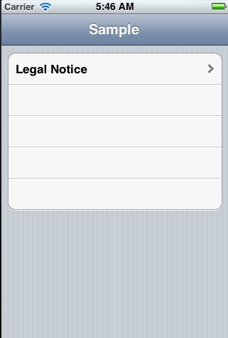
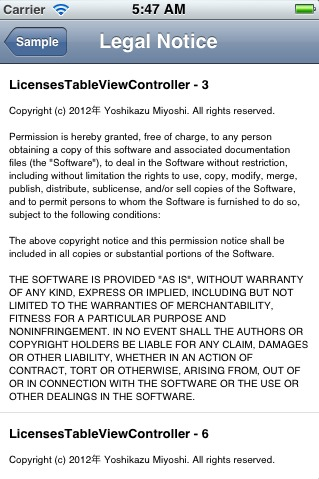

#LicensesTableViewController
This library is useful to add "Legal Notice"(MIT, BSD, MPL, Apache,...) TableViewController.

#Usage
Please see "SampleLicensesTableViewController" Folder.

#LicensesTableViewController
このライブラリは”ライセンス表記”(MIT, BSD, MPL, Apache,…) など、オープンソースを利用するときに必要な記述をTableViewで表現します。

#使い方
サンプルコードを"SampleLicensesTableViewController"フォルダに準備しているのでよく見てください。

#Screenshot

